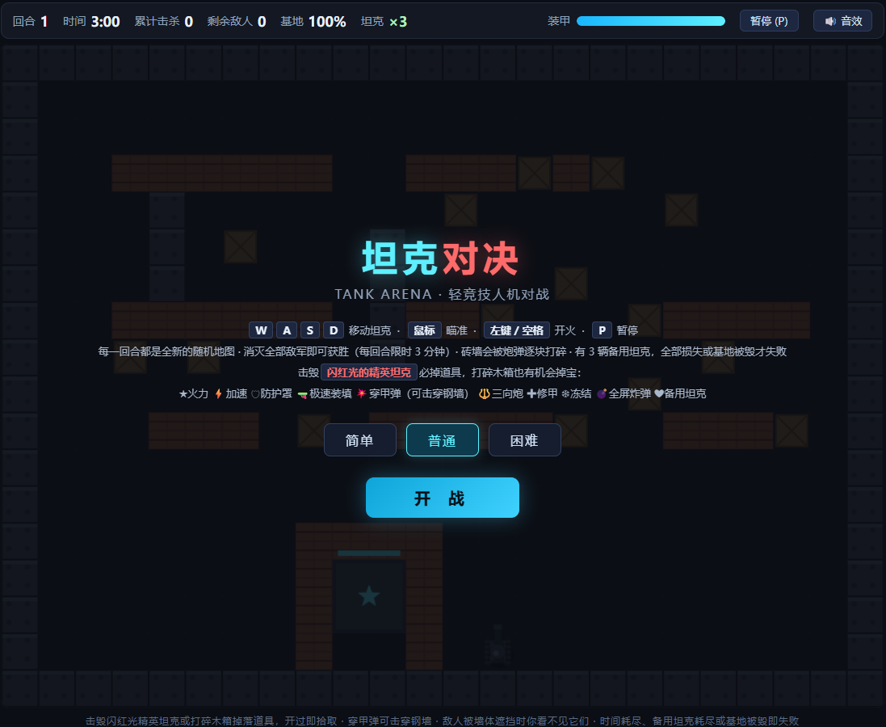
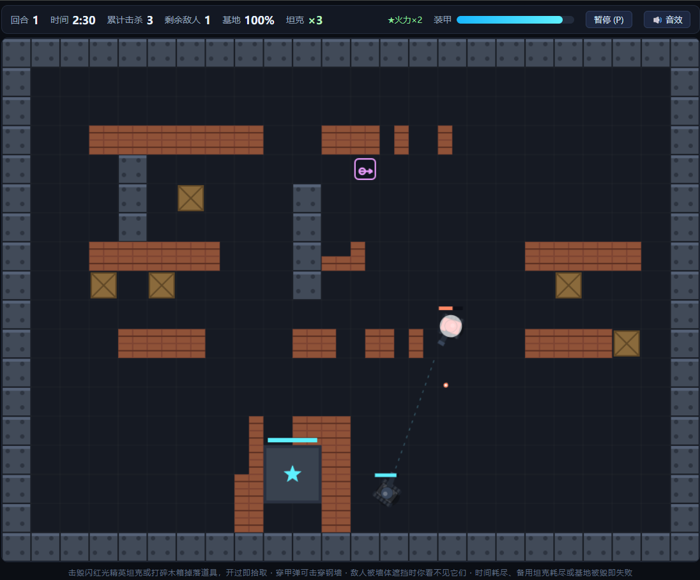
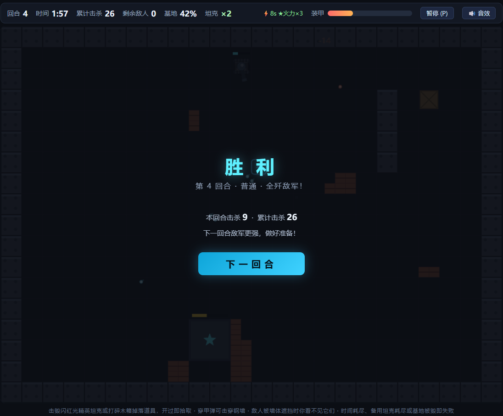

# TankBattle · 单文件 HTML 坦克大战

周末摸鱼写的小游戏。**一个 HTML 文件，双击就能玩**：不联网、不安装、不注册、无广告。

## 玩法

- `WASD` 移动，鼠标瞄准，左键开火
- 敌人会绕后包抄，共 **4 种兵种**（速度/血量/包抄概率不同）
- 每局地图随机生成，输了重开换一张新图
- 三档难度可选

## 怎么跑

方式一（推荐）：下载 `tank-battle.zip`，解压，双击 `tank-battle.html`。

方式二：直接下载 `tank-battle.html`，双击。

没有任何依赖，不需要起服务器。

## 截图

| 主界面 | 战斗中 | 通关结算 |
|---|---|---|
|  |  |  |

## 技术说明

- 原生 JavaScript + Canvas，无框架
- 逻辑、样式、资源全部内联，零外部请求 → 真离线
- 打包后 **21KB**
- 游戏循环用 `requestAnimationFrame`；敌人 AI = 朝玩家移动 + 随机包抄偏移；碰撞用 AABB + 圆形近似
- 想改成自己的版本：直接编辑 `tank-battle.html` 即可，参数都在文件顶部的配置对象里

## 许可

MIT。个人随便玩；商用请先开个 issue 问一声。
